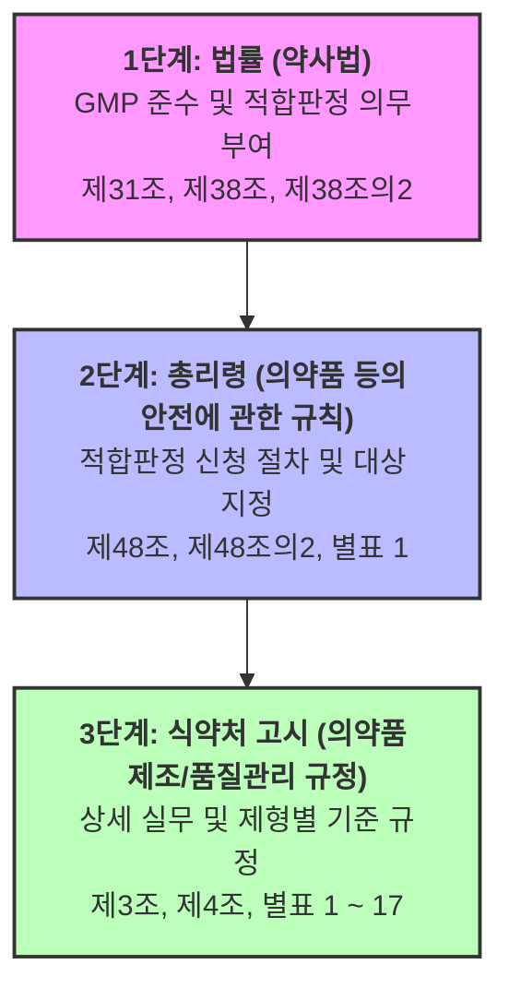

# 💊 약사법-GMP 연계 학습 가이드

이 문서는 대한민국 **약사법**, **의약품 등의 안전에 관한 규칙(시행규칙)**, 그리고 **의약품 제조 및 품질관리에 관한 규정(식약처 고시)** 간의 유기적인 GMP(우수의약품 제조 및 품질관리기준) 체계를 이해하고 공부하기 위한 대시보드 및 가이드라인입니다.

---

## 🗺️ GMP 법적 체계 및 로드맵

대한민국의 GMP 규정은 법률에서 고시까지 **3단계 수직 구조**로 위임되어 있습니다. 아래 링크를 통해 각 법령의 원문으로 바로 이동할 수 있습니다.

*   **1단계 (법률)**: [[대한민국 법률/legalize-kr/kr/약사법/법률|약사법 법률.md]]
*   **2단계 (총리령)**: [[대한민국 법률/legalize-kr/kr/의약품등의안전에관한규칙/총리령|의약품 등의 안전에 관한 규칙 (총리령).md]]
*   **3단계 (식약처 고시)**: [[대한민국 법률/admrule-kr/국무총리/식품의약품안전처/고시/의약품 제조 및 품질관리에 관한 규정/본문|의약품 제조 및 품질관리에 관한 규정 (본문).md]]

---

## 🔍 핵심 연계 조항 분석

### 1. 제조업 허가 및 GMP 적합판정 (제조의 시작)
*   **약사법 제31조 (제조업 허가 등)**
    *   의약품을 제조하려는 자는 식약처장의 제조업 허가를 받아야 하며, 품목허가를 받거나 품목신고를 해야 합니다.
    *   이때 시설 기준 및 GMP 적합 판정이 필수 요건으로 작용합니다.
*   **의약품 등의 안전에 관한 규칙 제4조 (제조판매품목의 허가 신청)**
    *   품목허가 신청 시 **GMP 적합판정서 사본** 또는 **GMP 평가 자료**를 제출해야 합니다.

### 2. 제조업자의 준수 의무 (GMP 준수의 근거)
*   **약사법 제38조 (의약품등의 제조관리의무)**
    *   제조업자는 자가시험을 포함하여 **의약품등의 제조 및 품질관리 기준(GMP)** 및 생산 관리에 관한 사항을 준수해야 합니다.
*   **의약품 등의 안전에 관한 규칙 제48조 (제업자 등의 준수사항)**
    *   제9호에서 각 제조업자가 준수해야 할 구체적인 별표 기준을 명시합니다.
        *   **완제의약품**: [[대한민국 법률/legalize-kr/kr/의약품등의안전에관한규칙/총리령#별표 1|별표 1 (의약품 제조 및 품질관리기준)]] 준수
        *   **원료의약품**: [[대한민국 법률/legalize-kr/kr/의약품등의안전에관한규칙/총리령#별표 1의2|별표 1의2 (원료의약품 제조 및 품질관리기준)]] 준수

### 3. GMP 적합판정 제도 (유효기간 및 실태조사)
*   **약사법 제38조의2 (제조 및 품질관리기준에 대한 적합판정)**
    *   의약품을 제조하여 판매하려는 경우, 식약처장으로부터 **GMP 적합판정**을 받아야 하며 유효기간이 설정됩니다.
*   **의약품 등의 안전에 관한 규칙 제48조의2 (제조 및 품질관리기준에 대한 적합판정)**
    *   실태조사를 거쳐 기준에 적합한 경우 **GMP 적합판정서**를 발급합니다.
*   **의약품 제조 및 품질관리에 관한 규정(식약처 고시) 제3조**
    *   적합판정서의 유효기간은 **3년**으로 규정하며, 현장조사 외의 방법으로 유효기간을 연장하는 경우 **2년**으로 연장할 수 있습니다.

---

## 📊 제형별 GMP 세부사항 매핑 (고시 위임 구조)

의약품 등의 안전에 관한 규칙 제48조에 따른 세부 실무 기준은 **식약처 고시**인 [[대한민국 법률/admrule-kr/국무총리/식품의약품안전처/고시/의약품 제조 및 품질관리에 관한 규정/본문|의약품 제조 및 품질관리에 관한 규정]]의 별표 1 ~ 17로 위임되어 있습니다.

|    번호     | 고시 별표 제목 (세부 GMP 분야) | 연관 총리령/조항                 |
| :---: | :--- | :--- |
| **별표 1** | 무균의약품 제조 | [[대한민국 법률/legalize-kr/kr/의약품등의안전에관한규칙/총리령#별표 1\|규칙 별표 1 (완제 GMP)]] |
| **별표 2** | 생물유래의약품의 원료 및 완제 제조 | [[대한민국 법률/legalize-kr/kr/의약품등의안전에관한규칙/총리령#별표 3\|규칙 별표 3 (생물학적제제)]] |
| **별표 9** | 컴퓨터화 시스템 (CSV) | [[대한민국 법률/legalize-kr/kr/의약품등의안전에관한규칙/총리령#별표 1\|규칙 별표 1]] 및 [[대한민국 법률/legalize-kr/kr/의약품등의안전에관한규칙/총리령#별표 1의2\|별표 1의2]] 공통 |
| **별표 11** | 임상시험용의약품 제조 | [[대한민국 법률/legalize-kr/kr/의약품등의안전에관한규칙/총리령#제38조의6\|규칙 제38조의6]] ~ [[대한민국 법률/legalize-kr/kr/의약품등의안전에관한규칙/총리령#제38조의9\|제38조의9]] (임상시험) |
| **별표 13** | 적격성평가와 밸리데이션 | [[대한민국 법률/legalize-kr/kr/의약품등의안전에관한규칙/총리령#별표 1\|규칙 별표 1 제6호 (밸리데이션)]] |
| **별표 15** | 원료의약품 제조 | [[대한민국 법률/legalize-kr/kr/의약품등의안전에관한규칙/총리령#별표 1의2\|규칙 별표 1의2 (원료 GMP)]] |
| **별표 17** | 완제의약품 제조 | [[대한민국 법률/legalize-kr/kr/의약품등의안전에관한규칙/총리령#별표 1\|규칙 별표 1 (완제 GMP)]] |

---

## 💡 학습 팁 및 옵시디언 활용법

1.  **백링크(Backlinks) 확인**: 
    각 법령 파일(`법률.md`, `총리령.md`, `본문.md`)을 읽을 때 옵시디언 우측 패널의 **백링크**를 활성화하면, 현재 조항이 이 학습 가이드의 어느 항목과 연결되어 있는지 바로 확인할 수 있습니다.
2.  **그래프 뷰(Graph View)**:
    옵시디언 그래프 뷰를 켜고 `약사법-GMP 연결 학습 가이드` 노트를 중심으로 연결된 법령 노드의 네트워크를 시각적으로 확인하며 공부하세요.
3.  **조항 링크 활용**:
    법령 원문 파일 내의 각 조항으로 바로 가기 위해 `[[총리령#제48조]]` 형태로 링크를 작성하여 이동하면 법적 연결고리를 따라가며 심화 학습을 할 수 있습니다.

---

## 🔍 실무용 GMP 개정 사항 검색 및 최신화 가이드

근무 중 특정 GMP 규정의 개정 여부나 상세 내용을 검색하고 싶을 때, 다음 **두 가지 방법**을 통해 가장 빠르고 정확하게 찾아낼 수 있습니다.

### 방법 1. 옵시디언 내 강력한 로컬 검색 (Ctrl + Shift + F)
이미 보관소 내에 법령 마크다운 파일들이 모두 다운로드되어 있으므로, 옵시디언 내부 검색창에 아래 검색식을 복사하여 입력하면 개정 사항을 쉽게 필터링하여 찾을 수 있습니다.

*   **특정 키워드(예: 밸리데이션) 관련 개정 사항 검색**:
    `"밸리데이션" "개정"` 또는 `"변경"`
*   **고시(행정규칙) 내에서만 검색하기**:
    `path:"대한민국 법률/admrule-kr" "개정"`
*   **정확한 조항 번호로 검색하기**:
    `"제48조"` 또는 `"제48조의2"`

### 방법 2. 국가법령정보센터 실시간 개정 연혁 확인 (추천)
로컬에 저장된 법령은 개정 시점에 따라 구버전일 수 있으므로, 실무적으로 중요한 의사결정을 내릴 때는 아래 **공식 실시간 연혁 검색 링크**를 클릭하여 최신 개정 조문을 확인하시는 것이 가장 안전합니다.

*   🔗 [약사법 법률 실시간 개정 연혁 (법제처)](https://www.law.go.kr/%EB%B2%95%EB%A0%B9/%EC%95%BD%EC%82%AC%EB%B2%95)
*   🔗 [의약품 등의 안전에 관한 규칙 실시간 개정 연혁 (법제처)](https://www.law.go.kr/%EB%B2%95%EB%A0%B9/%EC%9D%98%EC%95%BD%ED%92%88%EB%93%B1%EC%9D%98%EC%95%88%EC%A0%84%EC%97%90%EA%B4%80%ED%95%9C%EA%B7%9C%EC%B9%99)
*   🔗 [의약품 제조 및 품질관리에 관한 규정 실시간 고시 개정 연혁 (식약처)](https://www.law.go.kr/%ED%96%89%EC%A0%95%EA%B7%9C%EC%B9%99/%EC%9D%98%EC%95%BD%ED%92%88%EC%A0%9C%EC%A1%B0%EB%B0%8F%ED%92%88%EC%A7%88%EA%B4%80%EB%A6%AC%EC%97%90%EA%B4%80%ED%95%9C%EA%B7%9C%EC%A0%95)

> [!TIP]
> 국가법령정보센터 웹페이지 상단의 **[공포일자]** 또는 **[신구조문대비표]** 버튼을 클릭하시면, 기존 규정 대비 어떤 부분이 어떻게 수정(신설, 삭제, 변경)되었는지 한눈에 비교하며 공부할 수 있습니다.

